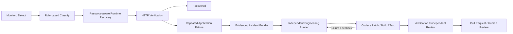

# OpsLoop

**Kubernetes 운영 복구에서 검증된 코드 수정 Pull Request까지 연결하는 Hybrid Failure-Recovery Testbed.**

OpsLoop는 Kubernetes 장애를 근거 기반 규칙으로 분류하고, 자원 상태를 고려한 Runtime Recovery를 시도하도록 설계된 프로젝트입니다. 운영 단계에서 해결되지 않는 반복 Application Failure만 독립된 Engineering Runner로 넘겨 Evidence 수집, 코드 분석·수정, Build/Test Feedback, Verification, Pull Request 생성으로 연결합니다.

> **현재 상태: Phase 0 Architecture v0.1 문서화.** 기능, CRD, Controller, Runner, CI/CD, Terraform, Kubernetes 환경은 아직 구현하거나 구축하지 않았습니다. 이 저장소의 동작 설명은 구현 목표와 수용 기준이며, 시연 성공이나 성능 측정 결과가 아닙니다.

## 프로젝트의 중심

“복구 가능한 장애는 운영 단계에서 자동으로 복구하고, 운영 단계에서 해결되지 않는 코드 문제는 개발 단계까지 자동으로 연결한다.”

개발·검증 비중은 DevOps / Kubernetes / Cloud / Runtime Recovery 약 70%, AI Engineering Recovery 약 30%를 목표로 합니다. AI 코딩 자체보다 운영 복구의 책임 경계, 재현성, 검증 가능성을 우선합니다.

## 목표 흐름

모든 Runtime 실패가 Engineering으로 전환되지는 않습니다. 자원 부족, 네트워크 장애, 이미지 인증 실패, 관측 데이터 부족은 운영 대응으로 남깁니다. PR 생성은 운영 서비스 복구 완료를 뜻하지 않으며 자동 Merge·재배포는 하지 않습니다.

## 목표 Testbed

| 실행 위치 | Architecture | 역할 |
| --- | --- | --- |
| Laptop Ubuntu VM | AMD64 | 단일 k3s server/control plane, OpsLoop·관측 스택, Recovery Candidate |
| Ubuntu Physical Server | AMD64 | k3s worker, Demo API Primary, Node Failure 실험 대상 |
| Azure Linux VM | ARM64 | k3s worker, 제한된 자원의 Cloud Recovery Candidate |
| Laptop Host | Kubernetes Node 아님 | 장애 주입, HTTP 검증·시간 측정, Engineering Runner |

Tailscale 실험망과 Multi-Architecture 이미지를 사용합니다. 이 구성은 **단일 control plane을 가진 실험 환경**이며 Enterprise Production Architecture나 HA를 주장하지 않습니다.

## 계획된 대표 Demo

- **Demo A — Node Failure:** Physical Server 장애 후, CPU·Memory 상태에 따라 Laptop VM 또는 Azure ARM64 Node를 선택합니다. 후보별 reject reason과 실제 HTTP 복구를 검증합니다.
- **Demo B — Application Failure:** 고정 입력으로 Application Crash를 반복 재현합니다. Runtime 예산 소진, Evidence 보존, workload 격리, Engineering Feedback loop를 거쳐 검증된 PR을 생성합니다.

두 Demo 모두 아직 구현·실행되지 않았습니다.

## 핵심 설계 결정

- Go + controller-runtime으로 Runtime Controller와 Incident Collector를 한 프로세스에 구성합니다.
- Kubernetes API는 상태·requests, Prometheus는 실제 CPU·Memory 사용량을 담당합니다.
- OpsLoop가 Node를 선택하고 `nodeSelector`를 변경하면 기본 Scheduler가 배치합니다. Custom Scheduler는 만들지 않습니다.
- `RecoveryPolicy`, `RecoveryIncident` 두 CRD에 정책과 영속 상태를 보관합니다.
- 초기 지원 대상은 replica 1개의 stateless Deployment 한 개입니다. partition 중 중복 실행을 허용하며 fencing을 보장하지 않습니다.
- Engineering Runner는 Controller와 별도 실행하며 Codex에 운영 자격 증명과 PR 게시 권한을 제공하지 않습니다.
- 검증은 모든 브랜치에서 수행하되 ACR 게시 권한은 보호된 main에만 부여합니다.

## 문서와 개발 진입점

| 문서 | 용도 |
| --- | --- |
| [Architecture v0.1](docs/architecture/architecture-v0.1.md) | 기준 Architecture, 상태 머신, Contract, 보안·검증·제약 |
| [Implementation Plan](docs/implementation-plan.md) | P0~P8 순서와 Phase별 Definition of Done |
| [ADR-001: 단일 k3s control plane](docs/adr/ADR-001-k3s-single-control-plane.md) | control plane, datastore, SPOF 결정 |
| [ADR-002: Runtime Placement](docs/adr/ADR-002-runtime-recovery-placement.md) | nodeSelector, rollout, 멱등성과 partition 처리 |
| [ADR-003: Observability 기반 복구](docs/adr/ADR-003-observability-driven-recovery.md) | 데이터 권위, filter, score, freshness |
| [ADR-004: Engineering 경계](docs/adr/ADR-004-engineering-recovery-boundary.md) | Runner, Codex, 검증·게시 권한 분리 |
| [ADR-005: Hybrid / Multi-Arch Testbed](docs/adr/ADR-005-hybrid-multi-architecture-testbed.md) | Tailscale, Azure, ACR, CI/CD, Production 구분 |

개발 순서는 **환경 적합성 확인 → 플랫폼 → ObserveOnly → Runtime Demo A → Incident Bundle → Engineering Demo B**입니다. 현재 실행 가능한 설치·빌드 명령은 제공하지 않습니다. 향후 실제 파일과 검증 결과가 생기면 해당 Phase에서 추가합니다.

## P1 전에 필요한 환경 확인

- Azure 구독의 ARM64 SKU·region·quota·Ubuntu 이미지 및 역할 할당 권한.
- Laptop VM·Host의 자원 여유, 절전 방지, Physical Server의 장애 후 관리 경로.
- LAN·VNet·Pod·Service CIDR 충돌 여부와 Tailscale ACL·연결·MTU 검증 계획.
- GitHub Actions·main 보호 규칙·OIDC subject와 ACR 게시 identity 구성 권한.
- k3s, Terraform provider, Helm chart, Go, Codex CLI, orchestration kit의 고정 version 선정.

세부 준비 사항과 미확정 값은 [Architecture의 외부 환경 항목](docs/architecture/architecture-v0.1.md#external-environment)을 참고합니다.

## 기술 범위와 제외 범위

계획된 기술은 Linux, Go, Docker/Buildx, Kubernetes/k3s, controller-runtime, Helm, Azure/Terraform, ACR, GitHub Actions/OIDC, Tailscale, Prometheus/Grafana, Codex입니다. 사용 기술 목록은 현재 구현 여부를 나타내지 않습니다.

Custom Scheduler, WAN etcd HA, Service Mesh, 불필요한 메시지 브로커, 초기 AKS 이전, AI 장애 분류, Auto Merge는 범위 밖입니다. 전용 Dashboard와 Argo CD는 핵심 End-to-End 완성 이후 선택 Phase입니다.

## 자격 증명과 라이선스

Terraform state·비밀 변수, credentials, kubeconfig, Runner worktree, build artifact, 로컬 환경 파일은 Git에 저장하지 않습니다. [.gitignore](.gitignore)는 실수 방지 수단이며 비밀정보 검토나 접근 통제를 대신하지 않습니다. `.terraform.lock.hcl`과 비밀값 없는 명시적 예제 파일은 향후 추적 대상입니다.

라이선스는 아직 선택하지 않았습니다. 사용자 선택 없이 `LICENSE`를 생성하지 않았으며, 공개·배포 조건을 정할 때 별도로 결정합니다.
