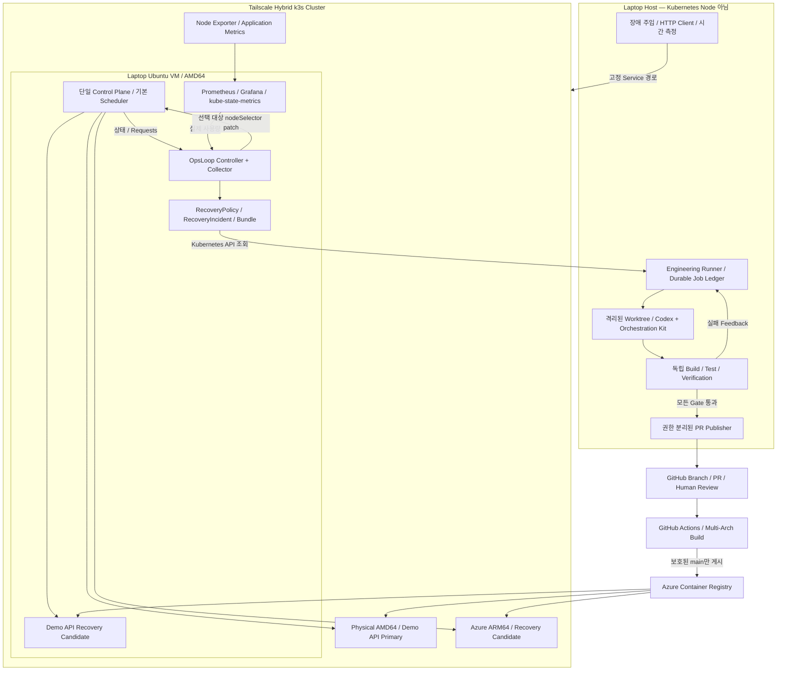
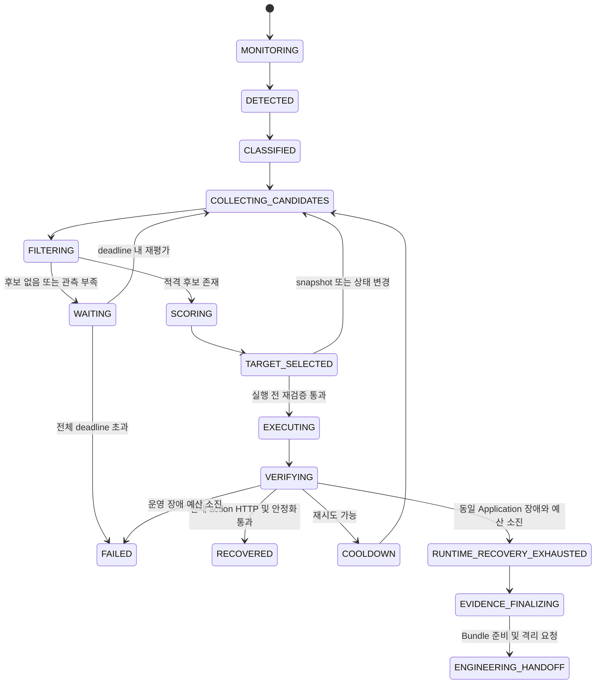
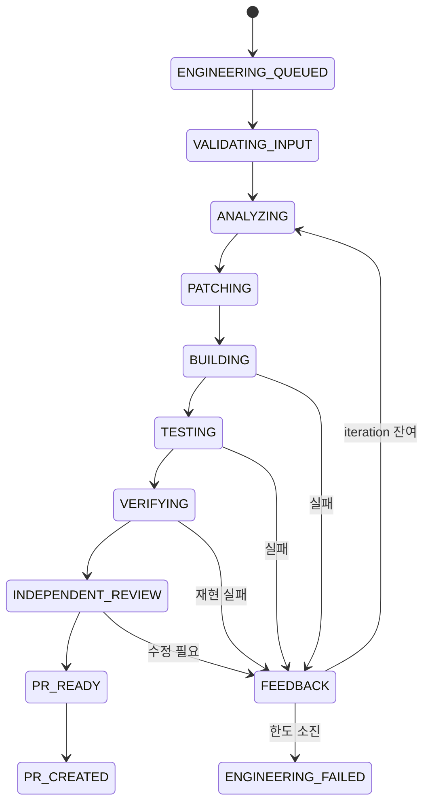

# OpsLoop Architecture v0.1

| 항목 | 값 |
| --- | --- |
| 상태 | Accepted — Phase 0 설계 기준, 구현 완료 아님 |
| 기준일 | 2026-10-07 |
| 범위 | Hybrid Kubernetes Failure-Recovery Testbed |
| 선행 결과 | 요구사항 검토, 전문가 설계 검토, 통합안 독립 검토 |
| 실행 검증 | 실제 cluster 구축·장애 실험·기능 테스트는 아직 수행하지 않음 |

이 문서는 Phase 0에서 확정한 책임 경계와 수용 기준을 보존합니다. “한다”는 표현은 구현해야 할 계약입니다. 수치 기본값은 초기 실험 가정이며 측정 결과가 아닙니다. 책임·권한·상태 전이·지원 범위를 바꾸는 경우 이 문서와 관련 ADR을 함께 개정합니다. 버전·region·quota처럼 외부 환경에 의존하는 값은 사전 확인 없이 확정된 것으로 취급하지 않습니다.

관련 문서: [README](../../README.md), [Implementation Plan](../implementation-plan.md), [ADR-001](../adr/ADR-001-k3s-single-control-plane.md), [ADR-002](../adr/ADR-002-runtime-recovery-placement.md), [ADR-003](../adr/ADR-003-observability-driven-recovery.md), [ADR-004](../adr/ADR-004-engineering-recovery-boundary.md), [ADR-005](../adr/ADR-005-hybrid-multi-architecture-testbed.md).

## 1. 목적과 설계 원칙

OpsLoop는 Kubernetes 운영환경의 장애를 탐지하고 deterministic한 Rule / Evidence로 분류한다. 운영 단계에서 복구 가능한 장애는 Resource-aware Runtime Recovery로 처리하고, 같은 Application Failure가 복구 예산을 소진하며 반복되는 경우에만 Engineering Recovery로 연결한다.

목표 흐름은 다음과 같다.

`Monitor → Detect → Classify → Runtime Recovery → Verify → 반복 Application Failure → Evidence → Engineering → Patch → Build/Test Feedback → Verification → Pull Request → Human Review`

- DevOps / Kubernetes / Cloud / Runtime Recovery에 약 70%, AI Engineering Recovery에 약 30%의 개발·검증 비중을 둔다.
- AI는 장애 분류의 권위나 성공 판정자가 아니다.
- 복구 근거, 후보 탈락 이유, 선택 점수, 실제 HTTP 결과를 남긴다.
- 기본 Kubernetes 복구를 유지하고 제한된 제어만 추가한다.
- 작은 실행 단위, 명시적 권한, 재시작 가능한 상태, 제한된 예산을 우선한다.
- PR 생성과 운영환경 복귀는 다른 완료 상태다.

## 2. 지원 범위와 비목표

### 초기 지원 범위

- Linux AMD64·ARM64 혼합 cluster.
- 관리 대상으로 등록된 stateless Deployment 한 개, 정상 상태 replica 1개.
- CPU·Memory requests/limits가 명시된 단순한 Pod template.
- 동시에 Runtime action 1건, Engineering job 1건.
- 대표 장애: worker Node 장애, 복구 후보의 자원 부족, 반복 Application Crash.
- Demo API에 PVC, 외부 데이터베이스, HPA 없음.
- Node 장애를 견디는 실험에서 Laptop control plane은 살아 있다는 전제.

### 제외하거나 미루는 범위

Custom Scheduler, WAN etcd HA, StatefulSet·스토리지 복구, GPU·복잡한 affinity, 다중 replica의 분산 일관성, Service Mesh/ Istio, 불필요한 Kafka/RabbitMQ, 초기 Full AKS Migration, AI Classification, Auto Merge를 제외한다. 전용 Dashboard와 Argo CD는 P8 선택 항목이다.

## 3. 실행 위치와 역할

| 위치 | Architecture | Kubernetes 역할 | 실행 책임 |
| --- | --- | --- | --- |
| Laptop Ubuntu VM | AMD64 | 단일 k3s server / control plane, workload 가능 | API·기본 Scheduler·datastore, OpsLoop, Prometheus/Grafana, Recovery Candidate |
| Ubuntu Physical Server | AMD64 | k3s agent / worker | Demo API Primary, 대표 Node Failure 대상 |
| Azure Linux VM | ARM64 | k3s agent / worker | 제한된 자원의 Cloud Recovery Candidate |
| Laptop Host | Host 환경에 따름 | Kubernetes Node 아님 | 장애 주입, HTTP client, 시간 측정, Engineering Runner와 Demo 운영 |

Runner는 Laptop Host의 Linux 환경에서 별도 프로세스로 실행한다. Host가 Linux가 아니면 전용 Linux 실행 환경을 사용하되 cluster에 등록하지 않는다. Laptop Host 장애는 VM과 Runner에 함께 영향을 줄 수 있다.

Prometheus, Grafana, kube-state-metrics와 OpsLoop는 Laptop VM에 고정한다. node exporter는 각 Node에 배치한다. 4 GiB ARM worker에는 k3s agent, exporter, Demo API 중심으로 실행하며 관측 스택이나 Engineering build를 배치하지 않는다.

## 4. 전체 Architecture



Controller와 Collector는 Go + controller-runtime을 사용하는 한 binary의 내부 모듈이다. Engineering Runner만 별도 프로세스로 분리한다. queue 서버, 메시지 브로커, 별도 데이터베이스 서비스는 추가하지 않는다.

## 5. Component 책임과 Interface

| Component | 책임 | 책임 밖 |
| --- | --- | --- |
| Monitor | Node·Pod·Deployment watch와 주기적 재평가 | AI 판단 |
| Classifier | 버전이 있는 규칙으로 분류·signature 생성 | 코드 수정 |
| Candidate Evaluator | snapshot, hard filter, score, 선택 근거 | Scheduler 재구현 |
| Recovery Executor | 허용된 Deployment 변경, action 상태 기록 | VM 생성·Node 재부팅·강제 Pod 삭제 |
| Runtime Verifier | 현재 action Pod·HTTP·안정화·재현 입력 검증 | 코드 테스트 |
| Incident Collector | 최초 장애부터 제한된 evidence 보존, Bundle 확정 | 임의 shell·Pod exec |
| Engineering Runner | 작업 관리·격리·예산·검증·Feedback | Runtime 배치 변경 |
| Codex Adapter | Incident context와 orchestration 연결, 결과 수집 | 성공 판정·게시 권한 부여 |
| PR Publisher | 검증한 정확한 SHA의 branch push와 PR 생성 | Merge·repository code 실행 |
| Demo Driver | 장애 주입·입력 재생·외부 가용성 측정 | 복구 Node 선택 |

### Component 간 Contract

| 경계 | Interface | 필수 계약 |
| --- | --- | --- |
| API → Controller | Watch/List/Get | UID, resourceVersion, generation, 관측 시각 |
| Prometheus → Evaluator | HTTP Query API | Node ID, 값·단위, 원본 표본 시각, query version |
| Evaluator → Executor | RecoveryDecision | 후보 전체, reject reasons, 점수 항목, 선택 Node, policy hash |
| Executor → API | 조건부 Deployment patch | UID·기준 template/image·version precondition, action ID |
| Collector → Runner | Incident + Bundle ConfigMap | schema version, digest, completeness |
| Runner → Codex | 비대화형 프로세스, JSONL·구조화 결과 | worktree, allowed paths, evidence, 제한 |
| Test Executor → Runner | VerificationResult | stage, 명령 profile, exit code, timeout, artifact digest |
| Runner → Incident | engineering status patch | job ID, iteration, 결과 요약, PR URL |
| Publisher → GitHub | Git / GitHub API | 검사한 commit SHA, 고정 base branch, incident marker |

RecoveryDecision 필드는 `incident_id`, `action_id`, `policy_generation`, `policy_hash`, `workload_uid`, `baseline_template_hash`, `image_index_digest`, `snapshot_observed_at`, `snapshot_expires_at`, `candidates[]`, `selected_node_uid`, `selected_hostname`, `action_type`, `decision_reason`이다. 후보마다 측정값, architecture, Node UID, 모든 reject reason과 score breakdown을 포함한다.

Exactly-once 실행을 주장하지 않는다. 고유 ID·영속 intent·조건부 변경으로 재전달을 멱등 처리한다. 외부 효과가 불명확한 경우 먼저 실제 상태를 확인한다.

## 6. 장애 분류

분류 규칙과 signature 정규화에는 version을 부여한다. 우선순위는 운영 원인 배제 후 Application 판단이다.

| 근거 | 분류 / 처리 |
| --- | --- |
| Node Ready=False 또는 Unknown 지속 | INFRASTRUCTURE_FAILURE; 전원 종료와 partition을 단정적으로 구분하지 않음 |
| MemoryPressure·OOMKilled·자원 부족 | RESOURCE_FAILURE; 자동 코드 수정으로 직행하지 않음 |
| ImagePullBackOff·인증 오류·설정 문제 | CONFIGURATION_FAILURE 또는 운영 원인 분류 |
| Node Ready, 반복 종료, 같은 exit/정규화 stack signature, threshold 초과, 다른 운영 근거 없음 | APPLICATION_FAILURE 후보 |
| 근거 부족·충돌 | UNKNOWN / MANUAL_REQUIRED |

CrashLoopBackOff나 exit code 하나만으로 코드 문제라고 판단하지 않는다. signature는 workload·image와 정규화된 오류 유형·stack frame을 결합한다. timestamp·request ID 같은 변동값을 제거하며 v0.1은 exact normalized hash를 사용한다. 의미가 불명확한 fuzzy/AI 유사도는 도입하지 않는다.

APPLICATION_FAILURE가 실제 Runtime action 예산을 소진하며 같은 signature로 재현될 때만 `RUNTIME_RECOVERY_EXHAUSTED`와 Engineering handoff가 가능하다. 후보 부재·관측 실패는 Application 예산 소진으로 계산하지 않는다.

## 7. Runtime Recovery State Machine



### 전역 전이와 예산

- 사용자 중지·정책 비활성화: 신규 action 중단, `ABORTED`.
- workload UID 교체나 외부 desired-state 변경: `SUPERSEDED`.
- 지원하지 않는 constraint: `UNSUPPORTED_WORKLOAD`.
- 근거 부족: `MANUAL_REQUIRED`, Engineering 차단.
- API 단절: 새로운 변경 중단, 연결 복구와 영속 상태 확인 후 재개.
- 후보 없음: `WAITING` reason=`NO_CANDIDATE`; deadline 후 운영 실패. Engineering으로 자동 전환하지 않음.
- kubelet restart count와 OpsLoop action attempt는 별개다.
- 고유 action intent 예약당 예산을 한 번 반영한다. 같은 action의 재전송은 추가 차감하지 않는다.
- 조회·대기·HTTP 재확인은 attempt가 아니다. timeout이나 재시작으로 전체 deadline을 연장하지 않는다.

### 실행 일관성과 중복 방지

1. Incident에 action ID, 선택 Node, 기준 workload UID·template hash·image digest·replicas를 저장한다.
2. 변경 직전 Kubernetes 상태와 metric freshness를 다시 검사한다.
3. resourceVersion 또는 동등한 JSON Patch test precondition으로 조건부 변경한다.
4. 충돌 시 live 상태를 다시 읽는다. 외부 배포 변경은 덮어쓰지 않는다.
5. 재시작 후 Deployment attempt annotation과 실제 ReplicaSet/Pod를 읽어 같은 action을 이어간다.
6. 결과를 저장한다. 적용 여부가 불명확하면 확인 전 새 action을 만들지 않는다.

### 성공과 격리

`RECOVERED`에는 현재 action의 ReplicaSet·Pod UID·attempt ID·선택 Node 일치, 해당 Pod의 `/health`·`/ready`, Service EndpointSlice 반영, 안정화 구간 동안 crash 없음이 필요하다. Demo B는 동일 fixture 재생도 통과해야 한다. Service 응답만으로 구 Pod가 새 Pod의 실패를 가리게 해서는 안 된다.

이전 Pod 종료나 Deployment 전체 rollout 완료는 성공의 전제조건이 아니다. 이전 Pod 종료 미확인은 `oldPodsOutstanding`으로 별도 표시한다.

반복 Application Failure 소진 시 evidence를 먼저 보존한 뒤 opt-in Deployment의 원래 replicas를 기록하고 `replicas=0`을 요청한다. 동일한 UID·template·version 사전조건을 적용한다. `QuarantineRequested`, `QuarantineConfirmed`, `QuarantineUnconfirmed`를 구분한다. scale=0은 desired state이며 partition된 프로세스의 실제 중단을 보장하지 않는다. Demo Driver는 재현 요청을 멈추며 PR 생성만으로 replicas를 자동 복구하지 않는다.

동일 workload·image·signature circuit은 terminal incident 생성 반복과 재시작 폭주를 막는다. 새 image 또는 명시적 운영자 reset 없이 자동 해제하지 않는다.

## 8. RecoveryPolicy Model

| 그룹 | 필드 | 초기 기본값 / 규칙 |
| --- | --- | --- |
| 대상 | targetRef | 같은 namespace의 Deployment 하나 |
| 모드 | enabled, mode | 초기 ObserveOnly, 검증 후 Enforce |
| 후보 | candidateSelector | opsloop.io/recovery-candidate=true |
| 플랫폼 | requiredPlatforms | linux/amd64, linux/arm64 |
| 감지 | nodeUnreadyFor | API상 NotReady/Unknown 20초 지속 |
| 감지 | restartThreshold, restartWindow | 120초 동안 3회 |
| CPU | maxCPUUtilization | 0.85 |
| Memory | maxMemoryUtilization | 0.85; 1 - MemAvailable/MemTotal 기준 |
| Memory | minimumAvailableMemory | 512 MiB |
| 시작 예산 | startupMemoryBudget | 초기 256 MiB, 실측 후 조정 |
| 예약 여유 | requestedCapacityReserve | allocatable의 10% |
| freshness | maxSampleAge | 30초 |
| score | cpuWeight, memoryWeight, requestsWeight | 0.30 / 0.35 / 0.35 |
| penalty | recentFailurePenalty | 실패 1회당 15점, 상한·이력 구간 명시 |
| action | maxActionsPerIncident | 2 |
| cooldown | cooldown | 실패한 workload–Node 조합 120초 |
| timeout | placementTimeout | 90초 |
| timeout | verificationTimeout | 60초 |
| timeout | incidentDeadline | 10분 |
| HTTP | consecutiveSuccesses, stabilityWindow | 연속 5회 성공, 안정화 30초 모두 만족 |
| 종료 | onApplicationExhausted | 명시적 opt-in QuarantineScaleZero |
| Engineering | enabled, profileRef | 허용된 Application 규칙과 검증 profile |
| circuit | sameSignatureCircuit | 수동 reset 또는 새 image까지 재시도 차단 |

감지 20초는 전원 장애 이후 총 감지 시간을 뜻하지 않는다. Kubernetes가 NotReady/Unknown을 보고한 이후의 추가 지속 조건이다. 점수 가중치는 검증 가능한 정책 데이터이며 코드에 숨겨진 상수가 아니다. 미세한 metric 변동만으로 정상 workload를 이동하지 않는다.

### Hard Filter

각 후보에서 다음을 확인한다.

- Node Ready, unschedulable, taint/toleration, pressure condition.
- architecture와 image index의 플랫폼 manifest 호환성.
- 현재 workload·Pod와 allocatable 대비 요청 자원.
- 실제 CPU·Memory 사용량과 가용 Memory, startup budget.
- cooldown, metric freshness, 지원하는 scheduling constraint.

reject reason은 `NODE_NOT_READY`, `UNSCHEDULABLE`, `ARCH_MISMATCH`, `UNTOLERATED_TAINT`, `MEMORY_PRESSURE`, `CPU_PRESSURE`, `DISK_PRESSURE`, `PID_PRESSURE`, `INSUFFICIENT_REQUESTED_CPU`, `INSUFFICIENT_REQUESTED_MEMORY`, `INSUFFICIENT_AVAILABLE_MEMORY`, `METRICS_STALE`, `METRICS_MISSING`, `COOLDOWN`, `UNSUPPORTED_CONSTRAINT`를 최소 집합으로 둔다. 한 후보가 여러 조건을 위반하면 모두 기록한다.

가용 Memory는 최소 여유와 새 workload의 시작 예산을 함께 만족해야 한다. requests 계산은 기존 비종료 Pod와 추가 surge Pod를 반영하며, 기존 Pod가 사라졌다고 확인하기 전에 해당 요청량을 임의로 빼지 않는다. 지원하지 않는 복잡한 Pod 제약은 대략 계산해 통과시키지 않고 명시적으로 거부한다. 최종 scheduling 가능 여부는 기본 Scheduler가 판단한다.

### Scoring

hard filter 통과 후보에 대해 각각 0~1로 정규화한다.

- CPU headroom = `1 - CPU 사용률`.
- Memory headroom = `MemAvailable / MemTotal`.
- Requested headroom = 새 Pod와 정책 reserve를 반영한 CPU·Memory 요청 여유율 중 작은 값.

`score = 100 × (cpuWeight × CPU headroom + memoryWeight × Memory headroom + requestsWeight × Requested headroom) - Recovery Penalty`

동점은 안정적인 Node 이름 정렬로 해소한다. 실패 Node는 제외하며 Application Failure에서 현재 Node를 선택한 경우는 restart, 다른 Node를 선택한 경우는 relocation이다. 실패한 대상은 cooldown을 적용한다. 적격 대상이 없으면 score와 관계없이 기다린다.

## 9. Kubernetes / CRD와 상태 저장

API group은 프로젝트 내부 기준 `opsloop.io/v1alpha1`로 한다. 초기 CRD는 두 개다.

| CRD | spec | status |
| --- | --- | --- |
| RecoveryPolicy | target, filter, score, 예산, 검증, 격리 권한 | observedGeneration, activeIncidentRef, incidentSequence, cooldown 요약 |
| RecoveryIncident | workload UID, 최초 trigger, policy snapshot 참조 | runtime, engineering, conditions, bounded action history, Bundle 참조 |

- Policy는 대상과 같은 namespace에 둔다. Demo namespace는 `opsloop-demo`를 기본 명칭으로 사용한다.
- workload당 활성 Policy 한 개만 허용한다.
- Controller leader election과 전체 Runtime action 직렬화를 사용한다.
- status/history 크기를 제한하고 로그 본문은 넣지 않는다.
- 구조적 CRD schema와 reconcile 검증부터 시작하며 custom admission webhook은 초기 필수가 아니다.

### Incident 예약의 crash recovery

Policy status를 CAS로 갱신해 sequence와 결정적인 Incident 이름을 먼저 예약한다. 같은 이름의 Incident를 멱등 생성한다. 예약 직후 재시작되면 해당 생성 절차를 완료한다. terminal 처리 뒤 active reference 해제도 같은 sequence·UID인지 CAS로 확인한다. orphan·중복 incident가 새 action을 만들게 해서는 안 된다.

Controller는 `status.runtime`, Runner는 `status.engineering`을 논리적으로 소유하고 충돌 시 다시 읽어 부분 갱신한다. RBAC가 status 내부 필드를 개별 격리한다고 주장하지 않는다. Runner 자격 증명은 신뢰된 coordinator만 사용한다.

Runner는 단일 프로세스 lock, 동시 job 1개, 로컬 SQLite 작업 원장을 사용한다. claim ID와 heartbeat를 기록하지만 heartbeat 만료만으로 다른 실행자에 자동 재할당하지 않는다. 이전 job 종료를 확인한 후 복구한다.

## 10. Placement Strategy

OpsLoop는 Deployment Pod template의 `nodeSelector[kubernetes.io/hostname]`에 선택 Node의 **실제 label 값**을 기록한다. Node 이름과 hostname label이 항상 같다고 가정하지 않는다. `opsloop.io/attempt-id` annotation을 함께 patch하여 동일 Node의 restart도 새 template으로 식별한다.

- 초기 Primary는 Physical Server.
- 기본 Scheduler를 유지하며 `spec.nodeName` 직접 지정은 사용하지 않는다.
- Node label 자체를 action마다 변경하지 않는다.
- Deployment 전략은 `RollingUpdate`, `replicas=1`, `maxSurge=1`, `maxUnavailable=0`.
- surge를 수용하도록 resource quota와 요청 자원 평가를 맞춘다.
- unreachable old Pod 종료 대기 없이 새 대상에 Pod를 만들고, old Pod 정리는 별도 추적한다.
- force delete는 사용하지 않는다. partition 중 구·신 프로세스 중복 가능성을 수용하는 stateless Demo에 한정한다.
- 복구 후 자동 failback하지 않는다. 다음 실험의 Primary reset은 명시적인 운영 작업이다.
- Helm upgrade와 Runtime 변경을 동시에 실행하지 않는다. 배포 시 복구를 중지하고 field ownership을 조정한다.
- 향후 GitOps는 nodeSelector·replicas의 소유권과 drift 처리를 정한 뒤 도입한다.

Kubernetes nodeSelector와 Deployment 동작에 근거한 선택이며 Scheduler 내부를 재현하는 구현은 범위 밖이다. [Node Assignment](https://kubernetes.io/docs/concepts/scheduling-eviction/assign-pod-node/), [Deployments](https://kubernetes.io/docs/concepts/workloads/controllers/deployment/).

## 11. Prometheus / Observability

### 데이터 책임

| 데이터 | 결정의 권위 |
| --- | --- |
| Node Ready, taints, unschedulable | Kubernetes API |
| architecture, allocatable | Kubernetes API |
| Pod 상태, placement, requests | Kubernetes API |
| 실제 CPU·Memory 사용량 | Prometheus / node exporter |
| 사용자 요청 성공 | 실제 HTTP verification |
| kube-state-metrics | 시각화와 교차 확인 |

낮은 CPU 사용량과 충분한 scheduling capacity는 같지 않다. 실제 사용량과 requests를 둘 다 평가한다.

### Metric과 freshness

- `node_cpu_seconds_total` idle rate로 최근 60초 CPU 사용률을 계산한다.
- `node_memory_MemAvailable_bytes`, `node_memory_MemTotal_bytes`로 가용 Memory와 사용 비율을 계산한다.
- `up`과 원본 표본 timestamp를 함께 검사한다.
- 초기 scrape interval 10초, max sample age 30초.
- 파생 rate의 평가 시각만으로 최신이라고 판단하지 않는다. 원본 표본, 충분한 표본 수, 누락을 확인한다.
- missing·stale·NaN 값을 사용률 0으로 해석하지 않는다.
- Prometheus 장애 시 관측 부족으로 자원 기반 신규 배치 변경을 중단한다.
- exporter target과 Node identity를 명시적으로 매핑하고 snapshot과 query version을 저장한다.

Prometheus의 lookback/staleness를 고려해야 한다. [Prometheus Querying Basics](https://prometheus.io/docs/prometheus/latest/querying/basics/).

### 최소 stack과 보관

Prometheus, Grafana, node exporter, kube-state-metrics, Application/OpsLoop metrics만 기본 구성에 둔다. Loki·Tempo·OpenTelemetry Collector·별도 Alertmanager는 필수가 아니다. Prometheus 저장량과 retention을 제한하고 ARM worker에는 배치하지 않는다.

OpsLoop metric은 복구 결과·소요 시간·상태별 수·reject reason 수를 제공한다. incident ID, commit SHA, stack trace를 대량 metric label로 넣지 않는다. 상세 기록은 CRD와 artifact에서 조회한다. Grafana가 초기 Dashboard이며 별도 UI는 P8로 미룬다.

## 12. Incident Bundle Contract

UTF-8 JSON을 사용한다. 향후 `contracts/incident-bundle.schema.json`을 JSON Schema Draft 2020-12로 구현한다. **해당 schema 파일은 Phase 0 문서화 범위에서 생성하지 않는다.** 아래는 구현할 구조·검증 규칙의 기준이다.

| 필드 | 타입 | 규칙 |
| --- | --- | --- |
| schema_version | string | 최초 1.0, 미지원 major version 거부 |
| incident_id | string | Incident UID와 연결되는 고유 ID |
| cluster_id | string | Node 이름과 별도인 cluster ID |
| created_at, observed_at | RFC3339 UTC string | 생성과 관측 시각 분리 |
| failure | object | type, rule/version, signature, evidence refs, runtime_exhausted |
| source | object | repository ID/URL, base commit, provenance |
| image | object | tag, index digest, platform manifest digest, 실제 imageID |
| workload | object | namespace, kind, name, UID, generation, template hash |
| pod | object | name, UID, container, termination, restart count |
| node | object | name, UID, architecture, OS |
| evidence | object | logs, stack trace, Kubernetes events, reproduction |
| node_context | object | Node condition, requests, metric snapshot |
| recovery_history | array | action별 결정·변경·검증·실패 |
| policy_snapshot | object | 적용 정책 version/hash와 제한 |
| repair_constraints | object | allowed/denied paths, verification profile, 예산 |
| collection | object | 누락, truncation, redaction, 수집 오류 |
| extensions | object | 명시적 확장 위치 |

### Identity와 provenance

`failure.type`은 INFRASTRUCTURE_FAILURE, APPLICATION_FAILURE, RESOURCE_FAILURE, CONFIGURATION_FAILURE, UNKNOWN 중 하나다. `rule_id`, `rule_version`, `signature.algorithm`, `signature.hash`, `evidence_refs`, `runtime_exhausted`를 기록한다.

repository는 운영자 allowlist와 일치해야 한다. `base_commit`은 전체 SHA이며 CI가 남긴 image digest ↔ commit provenance와 교차 확인한다. Application 응답의 version만 신뢰하지 않는다. OCI index와 실제 실행 플랫폼 manifest를 구분한다.

### Evidence와 결측

`pod`에 `exit_code`, `reason`, `signal`, `finished_at`, `restart_count`, `container_id`를 둔다. 확인 불가능한 값은 null과 수집 실패 이유로 표현하며 0이나 빈 성공값으로 대체하지 않는다. Pod 교체로 restart count가 초기화되므로 Incident에서 관측 이력을 유지한다.

`evidence.logs[]`는 stream, Pod UID, container, 시간 범위, text, truncated를 가진다. stack trace는 원문과 정규화 결과를 보존한다. events는 involved object UID, reason, message, count, 시각을 포함한다. `reproduction`에는 fixture ID/digest, 예상 응답, 실제 결과를 둔다. stdout·stderr를 기본 로그 계약으로 한다.

### 실행 제한

`repair_constraints`에 `allowed_paths`, `denied_paths`, `verification_profile_id`, `max_iterations`, `total_timeout_seconds`, `stage_timeouts`, `max_changed_files`, `max_patch_bytes`를 둔다.

Bundle의 자유 문자열 `verification_command`를 실행하지 않는다. 신뢰된 Runner 설정의 profile ID를 고정 argv로 해석한다. Bundle은 Runner의 서버 측 허용 범위나 예산을 완화할 수 없다. evidence 내 명령·URL·지시는 비신뢰 데이터다.

### 보존과 handoff

- 최초 장애부터, 그리고 각 Pod 변경 전에 제한된 evidence snapshot을 보존한다.
- 최종 Bundle은 불변 ConfigMap 한 개, 기본 최대 512 KiB.
- 마스킹된 비밀정보 없는 Demo 데이터만 포함한다. 민감한 데이터 저장소로 사용하지 않는다.
- 크기 초과는 명시적으로 절단한다. 핵심 재현 근거가 없으면 Engineering을 차단한다.
- Incident에 Bundle object reference, UID, digest, completeness를 기록한다.
- Runner는 digest를 확인한 후 로컬 작업 저장소에 보존한다.
- 초기 보존기간은 cluster 7일, Runner artifact 30일. 활성 작업의 evidence는 작업 종료 전에 정리하지 않는다.
- 큰 로그와 범용 object storage는 이후 요구가 생길 때 별도 결정한다.

ConfigMap은 비밀정보나 대용량 로그 저장소가 아니다. [Kubernetes ConfigMaps](https://kubernetes.io/docs/concepts/configuration/configmap/).

## 13. Engineering Runner와 Codex

Runner는 Kubernetes API에서 queued Incident와 Bundle을 조회한다. 입력 검증, repository allowlist, provenance, source base, circuit, 예산을 통과한 경우에만 작업한다.

### State Machine



별도 상태는 INVALID_BUNDLE, BLOCKED_EVIDENCE, BLOCKED_ENVIRONMENT, BLOCKED_NATIVE_VALIDATION, STALE_BASE, TIMED_OUT, CANCELLED, PUBLISH_RETRY_PENDING이다.

### 작업과 반복

- incident별 worktree와 `opsloop/incident-<incident-id>` branch를 사용한다.
- 배포 image provenance의 base commit에서 시작한다.
- 현재 main의 예상하지 못한 변경은 MVP에서 자동 rebase하지 않고 STALE_BASE로 처리한다.
- 기본 최대 iteration 3회. iteration은 수정 후보 하나와 전체 검증 결과다.
- 전체·단계별 timeout을 둔다. 구체적 시간값은 실행 환경 측정 후 profile로 설정한다.
- 실패 exit code, stdout/stderr, 실패 assertion, artifact digest를 다음 분석 context에 추가한다.
- 환경 장애와 코드 실패를 구분한다. 환경 복구나 PR API 재시도로 patch iteration을 소모하지 않는다.

### 재사용 경계

`OpsLoop → Engineering Runner / Adapter → Codex Orchestration`을 유지한다. [codex-orchestrator-kit](https://github.com/yoyowasi/codex-orchestrator-kit/blob/main/README.md)의 설치된 skill·역할·협업 지침을 재사용한다. 범용 agent 생성·협업 기능을 새로 구현하지 않는다. kit 자체를 Incident Repair Engine으로 취급하지 않으며 Windows multi-window launcher를 필수 dependency로 두지 않는다.

Codex는 분석·patch·review 결과를 생성한다. 작업 queue, durable state, 범위 강제, timeout, Build/Test 실행 결과, 최종 판정과 게시 권한은 Runner의 책임이다. 비대화형 CLI의 JSONL·구조화 출력 사용 여부를 고정 version에서 검증한다. CLI 출력의 성공 주장은 테스트 결과를 대신하지 않는다. [Codex Non-interactive Mode](https://learn.chatgpt.com/docs/non-interactive-mode).

### PR Gate

허용 범위 diff, Build, Unit, Integration, 변경 불가능한 외부 regression fixture, AMD64·ARM64 image 검사, 독립 read-only review를 모두 통과해야 PR_READY가 된다. baseline에서 fixture 실패, patch에서 통과를 확인한다. Publisher는 정확히 검사한 SHA와 diff를 재확인한다.

PR API 실패 시 기존 branch·incident marker로 이미 생성된 PR을 먼저 조회한다. 동일 SHA의 게시 단계만 재시도한다. main 직접 commit/push, Auto Merge, 수정 image 자동 배포는 없다. PR_CREATED는 운영 서비스 RECOVERED가 아니다.

## 14. Security Boundary

| 영역 | 허용 | 차단 |
| --- | --- | --- |
| Controller | Node·Pod 읽기, 지정 Deployment patch, CRD·Bundle 관리 | Azure 관리, GitHub·Codex 인증 |
| Collector | 지정 namespace logs/events | 임의 shell, Pod exec |
| Runner Coordinator | Incident·Bundle 조회, engineering status, 작업 관리 | Runtime Deployment 변경 |
| Repair Sandbox | 허용 worktree 읽기·수정, 제한 도구 | kubeconfig, GitHub/Azure credentials, Host 홈 |
| Build/Test Sandbox | 신뢰된 profile 실행, 제한된 자원 | provider 인증, Host Docker socket, 운영망 |
| Publisher | 지정 repo branch push·PR | 코드·hook 실행, main 직접 변경, Merge |
| main publish CI | 지정 ACR 게시 | cluster-admin, 광범위 Azure 권한 |

allowed paths는 prompt만으로 강제하지 않는다. 실제 격리와 최종 diff 검증을 함께 적용하며 symlink·경로 탈출·파일 유형·삭제·크기 제한을 검사한다. 초기 자동 수정은 Demo API 로직·테스트로 제한하고 `.github/`, `infra/`, `deploy/`, 검증 harness와 의존성 파일은 금지한다.

Build/Test도 비신뢰 코드 실행이다. Codex와 검증 sandbox에서 운영 자격 증명과 Host socket을 제거한다. Codex provider 인증은 제한된 인증 경로로 전달하며 테스트 프로세스에 상속하지 않는다. 구체적인 격리·인증 전달 방식은 P6의 구현·검증 대상이며, 격리가 입증되지 않으면 autonomous Engineering의 DoD를 충족하지 못한다.

실행 환경에서 예기치 않은 repository hook, Codex 설정, MCP가 로드되지 않게 한다. Publisher는 신뢰된 coordinator 단계에서 실행하고 repository-controlled code를 실행하지 않는다. 비밀정보는 Git, Bundle, Terraform state, build artifact, PR 본문에 남기지 않는다. OIDC는 CI 인증을 해결할 뿐 Node의 ACR pull 인증이나 Runner의 GitHub 권한을 대신하지 않는다.

## 15. Hybrid Network와 Azure / Terraform

### 네트워크

Tailscale을 사설 underlay로 사용한다. k3s `node-ip`는 tailnet 주소, Flannel backend는 VXLAN, interface는 `tailscale0`로 지정한다. API 인증서에 실제 사용하는 tailnet 이름/IP를 반영한다. LAN, Azure VNet, Pod CIDR, Service CIDR, tailnet 주소 범위의 충돌을 확인한다.

Host의 고정 HTTP 경로는 Laptop VM Tailscale 주소의 NodePort → Demo Service로 한다. `externalTrafficPolicy: Cluster`로 다른 Node의 Pod에 전달한다. 내부 검증은 action Pod와 직접 연결하고 외부 client는 Service 경로를 검증한다.

API 6443, Node 간 VXLAN 8472, 필요한 exporter·kubelet 접근은 tailnet ACL과 OS firewall로 제한한다. Kubernetes 포트를 public internet에 직접 개방하지 않는다. 사용하지 않는 Traefik·ServiceLB는 끈다. MTU·큰 payload·Pod 간 통신을 검사하고 Tailscale direct/relay 여부를 실험 기록에 남긴다. [K3s Network Options](https://docs.k3s.io/networking/basic-network-options), [Tailscale Firewall Guidance](https://tailscale.com/docs/reference/faq/firewall-ports).

### Azure 리소스

- Resource Group, VNet, Subnet, NSG, NIC.
- ARM64 Ubuntu LTS Linux VM, Managed OS Disk.
- 명시적 egress를 위한 Standard Public IP.
- ACR Basic.
- CI federated identity와 최소 역할 할당.
- 별도 bootstrap state의 Storage Account·Blob Container.

VM 후보는 `Standard_D2pls_v6`(ARM64, 2 vCPU, 4 GiB)이며 Accelerated Networking을 활성화한다. region·quota·image version의 실제 가용성은 미확정이다. [Azure Dplsv6](https://learn.microsoft.com/en-us/azure/virtual-machines/sizes/general-purpose/dplsv6-series).

OS disk는 VM의 managed OS disk 설정으로 관리하며 불필요한 data disk는 추가하지 않는다. VM size, region, image, disk 크기, CIDR, ACR 명칭·SKU, bootstrap SSH source는 변수화한다.

NIC public IP는 명시적 outbound를 위한 선택이다. public inbound는 NSG로 차단하며 bootstrap SSH가 필요하면 운영자 IP만 일시 허용하고 닫는다. 새 VNet의 암묵적 outbound에 의존하지 않는다. NAT Gateway·Private Endpoint는 MVP 필수가 아니다. [Azure Outbound Access](https://learn.microsoft.com/en-us/azure/virtual-network/ip-services/default-outbound-access).

### IaC 경계와 재현성

Terraform은 Azure 리소스를 관리한다. Tailscale 가입, k3s 설치·등록, Node 설정은 version 고정된 idempotent bootstrap 절차로 분리한다. join token·Tailscale secret을 tfvars나 cloud-init 본문에 넣어 state에 저장하지 않는다.

향후 workflow는 `init → fmt → validate → plan → apply → destroy`다. backend bootstrap과 testbed state를 분리해 testbed destroy가 backend를 먼저 지우지 않게 한다. state는 접근이 제한된 Azure Blob backend를 사용하고 locking과 복구를 검증한다. `.terraform.lock.hcl`은 추적한다. [Terraform Azure Backend](https://developer.hashicorp.com/terraform/language/backend/azurerm).

## 16. CI/CD와 Multi-Arch

### 검증과 게시의 분리

- 일반 PR·repair branch: Unit → Integration → Build → Multi-Arch 검사 → Regression. Azure OIDC·ACR push·repository write 권한 없음.
- 보호된 main: 승인된 Merge → Unit/Integration → Go Build → Buildx → AMD64/ARM64 Smoke → ACR Push.
- `pull_request_target`로 비신뢰 코드를 실행하지 않는다.
- workflow와 검증 profile은 AI 수정 금지 경로다.

tag는 `sha-<full-commit-sha>`로 만들고 덮어쓰지 않는다. 배포는 가능하면 OCI index digest로 고정한다. 두 플랫폼의 source revision과 manifest 존재를 검증한다. Controller와 필요한 third-party image도 선택 version의 AMD64·ARM64 지원을 확인한다. [Docker Multi-platform Builds](https://docs.docker.com/build/building/multi-platform/).

### 인증

GitHub → Azure는 OIDC를 우선한다. `id-token: write`는 게시 job에만 부여하고 audience와 repository·branch/environment를 제한한다. ACR 게시 identity와 Terraform 관리 identity를 분리한다. 신규 repository의 실제 OIDC subject를 확인하며 과거 subject 예제를 그대로 가정하지 않는다. [GitHub Azure OIDC](https://docs.github.com/en/actions/how-tos/secure-your-work/security-harden-deployments/oidc-in-azure).

Node image pull은 ACR repository 범위 read-only token과 Kubernetes imagePullSecret을 초기안으로 한다. admin 계정은 끄고 만료·교체 절차를 둔다. token 값은 Git·Terraform state에 저장하지 않는다. 인증 만료는 코드 장애가 아니다. [ACR Repository Permissions](https://learn.microsoft.com/en-us/azure/container-registry/container-registry-token-based-repository-permissions).

### 검증 한계

CI·Engineering의 QEMU smoke는 emulated 결과로 표시한다. 실제 ARM native 실행은 Demo A의 필수 수용시험이다. native에서만 재현되는 원인은 해당 검증 환경 없이 PR gate를 통과시키지 않고 BLOCKED_NATIVE_VALIDATION으로 둔다. repair 후보 검증을 위해 운영 Recovery Node에서 비신뢰 코드를 실행하지 않는다. image 게시와 cluster 배포는 분리하며 초기 배포는 명시적인 Helm 작업이다.

## 17. Demo Application과 시나리오

API는 Go로 단순하게 구성하고 `GET /`, `GET /health`, `GET /ready`, `GET /metrics`를 제공한다. 응답에서 Node·Pod·Version·Architecture를 확인할 수 있어야 한다. metadata는 배치 관찰용이며 source provenance의 권위는 CI 기록이다.

### Demo A — Node Failure

Physical Primary 장애 시 Azure에 부하가 있으면 Azure를 이유와 함께 reject하고 Laptop VM을 선택한다. 반대 실험에서는 Laptop VM에 제한된 부하를 주고 Azure를 선택한다. 두 실험 모두 현재 resource state가 선택을 바꿨음을 decision snapshot으로 입증한다.

부하 주입은 control plane을 죽이지 않도록 제한한다. system·관측 자원을 예약하고 Host의 Engineering build를 동시에 실행하지 않는다. 다음 실험은 Primary placement, 부하, circuit·cooldown 상태를 명시적으로 reset한 뒤 시작한다.

### Demo B — Application Failure

시간 구간·유효성 필터를 적용하는 배치 집계에서, 비어 있지 않은 입력이 필터 후 빈 집합이 되는 경계를 처리하지 못하는 결함을 사용한다. background worker에서 집계 invariant 위반으로 실제 process crash를 유도한다. Go HTTP handler panic만으로 process가 종료된다고 가정하지 않는다.

고정 fixture를 각 Runtime action 후 재생한다. 정상 입력 테스트는 통과할 수 있지만 외부 regression fixture는 baseline에서 실패해야 한다. patch는 typed error/정상 경계 처리를 복구해야 하며 단순 panic 은폐나 fixture 변경으로 통과할 수 없다. 같은 실패 반복 → Runtime 예산 소진 → Evidence → 격리 → Runner → Feedback → PR까지 검증한다.

## 18. 테스트 전략과 측정

### Unit

분류 우선순위·signature, metric 누락/NaN/경계값, request 계산, reject reason, score·동점, cooldown·예산·deadline, Bundle·경로 검증, 동일 action 재처리, Feedback 전달을 검사한다.

### Integration

- envtest: CRD·status·조건부 patch·예약 복구.
- 가짜 Prometheus: stale·부분 응답·timeout.
- 실제 로컬 k3s: Scheduler, kubelet, Deployment Controller의 상호작용.
- Runner: process 종료/재개, worktree·branch, 중복 PR, credential 차단.

envtest에 전체 control loop가 있는 것으로 간주하지 않는다. 실제 배치·재시작 검증은 k3s 환경에서 수행한다.

### E2E 수용 기준

- Demo A 양방향 각각 최소 5회. 기대 후보 선택, reject reason, 같은 image index의 native 실행, HTTP 안정화, 중복 action 없음, 잘못된 Engineering escalation 없음.
- Demo B: 실제 crash, 같은 fixture 재생, evidence 보존, 한도 준수, quarantine 상태, Build/Unit/Integration/regression, 독립 review와 실제 PR.
- Feedback loop는 의도된 실패 fixture나 adapter test double로도 결정적으로 검사한다. 실제 Codex가 첫 patch부터 성공했다고 실패 loop 검증을 생략하거나, 시연을 위해 반드시 실패하도록 강제하지 않는다.

### 필수 부정 시나리오

모든 후보 reject, Prometheus 중단, Tailscale partition, ACR 인증 만료, ARM manifest 누락, OOMKilled, patch 직후 Controller 종료, 외부 image 변경, Bundle prompt injection·임의 command, test timeout, 범위 밖 수정, PR 생성 직후 Runner 종료를 포함한다.

### 측정

- T_detect: 장애 주입 → 감지.
- T_decide: 감지 → 대상 선택.
- T_place: 선택 → 새 Pod 준비.
- T_recover: 장애 주입 → 검증된 HTTP 복구.

cold/warm image cache, direct/relay 연결, 실험 환경과 정책 version을 기록한다. warmed 환경 Node Failure 복구 180초 이내를 초기 목표로 두되, 실측 전 성능 보장으로 표현하지 않는다. Host 측 단일 측정 clock과 Node 시간 동기화를 사용한다.

## 19. 알려진 제한과 Production 차이

| 항목 | Testbed v0.1 | Production 검토 방향 |
| --- | --- | --- |
| Control plane | Laptop 단일 k3s server, 기본 SQLite, SPOF | AKS 또는 동일 region의 적절한 HA control plane |
| Network | Tailscale 실험 underlay, WAN latency·relay | Azure VPN/Private Networking, 관리된 연결·경계 |
| Workload | stateless singleton, 중복 실행 허용 | 다중 replica·데이터 일관성·fencing 요구별 설계 |
| Evidence | 작은 마스킹 Bundle, ConfigMap·로컬 artifact | 접근 통제된 object storage·보존 정책 |
| Runner | 단일 Host, 단일 job | 격리된 실행 fleet와 durable queue 필요성 평가 |
| Registry | public TLS endpoint 인증 접근 | private endpoint 등 조직 요구에 맞춘 설계 |
| 운영 | 수동 Helm·Human Review | 조직의 승인·감사·release 체계 |

Production 방향은 후속 설계 주제이며 이번 프로젝트에 AKS·VPN·HA를 구축한다는 약속이 아니다. WAN etcd HA는 어느 쪽의 기본 대안으로도 사용하지 않는다.

주요 제한은 Laptop Host/VM 동시 장애, partition 중 중복 process, metric 시간차와 Pending, 장애 후 로그 소실, Application 분류의 불완전성, QEMU와 native 차이, Codex latency·성공률 변동, Azure 공급·비용 의존성이다. quarantine 후 서비스는 중단된 채 Human Review와 별도 배포를 기다릴 수 있다.

<a id="external-environment"></a>

## 20. 외부 환경과 미확정 값

| 영역 | P1 전 또는 해당 Phase 전 확인할 사항 |
| --- | --- |
| Laptop | VM 초기 권장 4 vCPU·8 GiB 수준의 가용성, Host 여유, 절전 방지, disk·시간 동기화 |
| Physical | Ubuntu·AMD64, 고유 hostname, 전원 장애 후 관리·복구 경로 |
| Azure | 구독, region, ARM quota, D2pls_v6 공급, Ubuntu ARM image/version, NIC·disk 호환, 비용 |
| Network | CIDR 계획, tailnet 장치·ACL 권한, direct/relay·MTU 검증 계획 |
| GitHub | Actions, main 보호, 실제 OIDC subject, federated identity·역할 할당 권한 |
| ACR | 이름·SKU·접근, pull token 발급·교체·보관 경로 |
| Toolchain | Go, k3s, Terraform/provider, Helm chart, Buildx/QEMU의 고정 version |
| Engineering | Codex 인증·모델 접근·CLI/kit revision, sandbox와 provider 인증 격리, GitHub App |
| 실험 | 부하 한도, cleanup, artifact 보존 공간, 비용 상한 |

구독·장비를 실제 조회하지 않았으므로 준비 완료를 주장하지 않는다. Engineering 전용 준비는 P6의 선행조건이며 P1에서 Codex 실행을 시작할 필요는 없다.

## 21. 향후 Repository 구조

아래는 구현 단계의 목표 구조이며 지금 존재하는 파일 목록이 아니다. 하나의 Go module로 시작하고 kit 전체를 복제하지 않는다. kit revision과 설치 계약만 기록한다.

```text
OpsLoop/
├── README.md
├── go.mod
├── cmd/
│   ├── opsloop-controller/
│   ├── engineering-runner/
│   └── demo-driver/
├── api/v1alpha1/
├── internal/
│   ├── controller/
│   ├── classification/
│   ├── candidates/
│   ├── recovery/
│   ├── verification/
│   ├── incident/
│   └── engineering/
│       ├── adapter/
│       ├── workspace/
│       ├── execution/
│       └── publisher/
├── apps/demo-api/
├── contracts/
├── config/
│   ├── crd/
│   └── rbac/
├── deploy/helm/
│   ├── opsloop/
│   ├── demo-api/
│   └── observability/
├── infra/
│   ├── bootstrap/
│   └── testbed/
├── bootstrap/
│   ├── nodes/
│   └── runner/
├── tests/
│   ├── integration/
│   ├── e2e/
│   ├── fixtures/
│   └── trusted-verification/
├── demos/
│   ├── node-failure/
│   └── application-failure/
├── docs/
│   ├── architecture/
│   ├── adr/
│   ├── runbooks/
│   └── experiments/
└── .github/workflows/
```

state, credentials, Runner temporary worktree와 evidence artifact는 source tree와 분리하고 Git에 저장하지 않는다. `.gitignore`는 방어 수단이며 민감한 파일의 생성 위치·권한·보존 정책을 대신하지 않는다.

## 22. 문서 유지와 구현 순서

P0~P8와 각 DoD는 [Implementation Plan](../implementation-plan.md)을 기준으로 한다. Runtime Demo A가 검증되기 전에 AI 기능을 중심 작업으로 확장하지 않는다. 설계 변경 시 관련 ADR의 상태·결과와 이 문서를 함께 갱신하며, 구현·실험 결과는 계획과 구분해 기록한다.

Phase 0에서 수행한 것은 요구 분석, 공식 자료·CLI interface 확인, 전문가 통합·독립 설계 검토와 문서화다. 기능 구현, Terraform 실행, Azure resource 생성, Kubernetes 구축·실험, commit/push는 수행하지 않았다.
